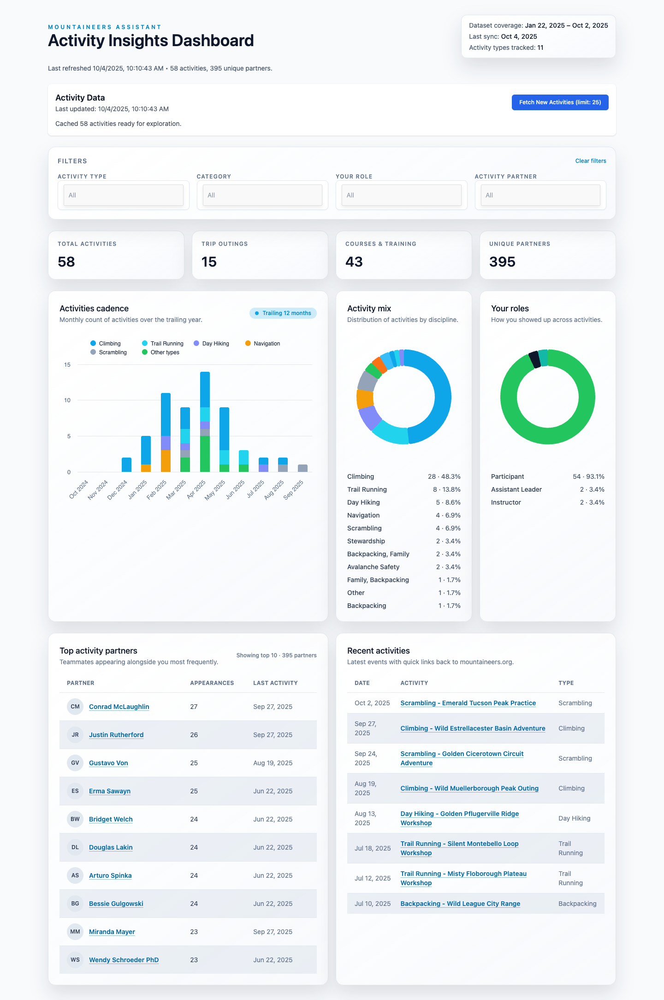

# Mountaineers Assistant

A Chrome extension that enhances your Mountaineers.org experience with personalized activity insights and analytics.

## Features

- **Activity History Sync** - Fetch and cache your Mountaineers activity data using your existing login session
- **Interactive Dashboard** - Explore visualizations of your climbing history with filters for:
  - Activity type (Alpine Scramble, Rock Climbing, etc.)
  - Category (Climbs, Courses, etc.)
  - Your role (Leader, Participant, etc.)
  - Activity partners

## Installation

### From Chrome Web Store (Recommended)

[Install from Chrome Web Store](https://chrome.google.com/webstore) _(link coming soon)_

### Manual Installation (Latest Development Build)

1. Download the latest release ZIP from [GitHub Releases](https://github.com/dreamiurg/mountaineers-assistant/releases)
2. Extract the ZIP file
3. Open Chrome and navigate to `chrome://extensions`
4. Enable **Developer mode** (toggle in top right)
5. Click **Load unpacked**
6. Select the extracted folder

## How to Use

### First Time Setup

1. **Log in to Mountaineers.org** in your browser
2. **Click the extension icon** in your Chrome toolbar
3. The **Insights dashboard** will open
4. **Click "Fetch New Activities"** to sync your data

The extension uses your existing Mountaineers.org session - no separate login required!

### Fetching New Activities

- Click **"Fetch New Activities"** from the Insights dashboard
- The extension will sync your activity history (typically takes 30-60 seconds)
- Progress updates show in real-time
- Data is cached locally for fast access

### Exploring Your Data

The Insights dashboard provides:

- **Activity statistics** - Total activities, success rate, date ranges
- **Visual charts** - Activity distribution by type and category
- **Activity list** - Searchable, filterable list of all your activities
- **Partner analysis** - See who you've climbed with most

Use the filters at the top to focus on specific activity types, time periods, or partners.

### Settings

Click **Preferences** to configure:

- **Fetch limit** - Limit how many recent activities to sync (useful for faster syncs)

## Privacy & Data

**Your data never leaves your browser.**

- All activity data is stored locally in Chrome's storage
- No external servers or analytics
- Only communicates with Mountaineers.org to fetch your data
- Uses your existing session cookies (same as browsing the site)

For technical details, see our [Privacy Policy](PRIVACY.md).

## Permissions

The extension requires these permissions:

- **storage** - Save your cached activity data locally
- **offscreen** - Run data collection in the background
- **tabs** - Open the insights dashboard when you click the extension icon
- **mountaineers.org** - Access your activity data using your login session

## Support

- **Found a bug?** [Report an issue](https://github.com/dreamiurg/mountaineers-assistant/issues)
- **Feature request?** [Open a discussion](https://github.com/dreamiurg/mountaineers-assistant/discussions)

## Contributing

Want to contribute? See [CONTRIBUTING.md](CONTRIBUTING.md) for developer setup and guidelines.

## License

MIT License - see [LICENSE](LICENSE) for details.
