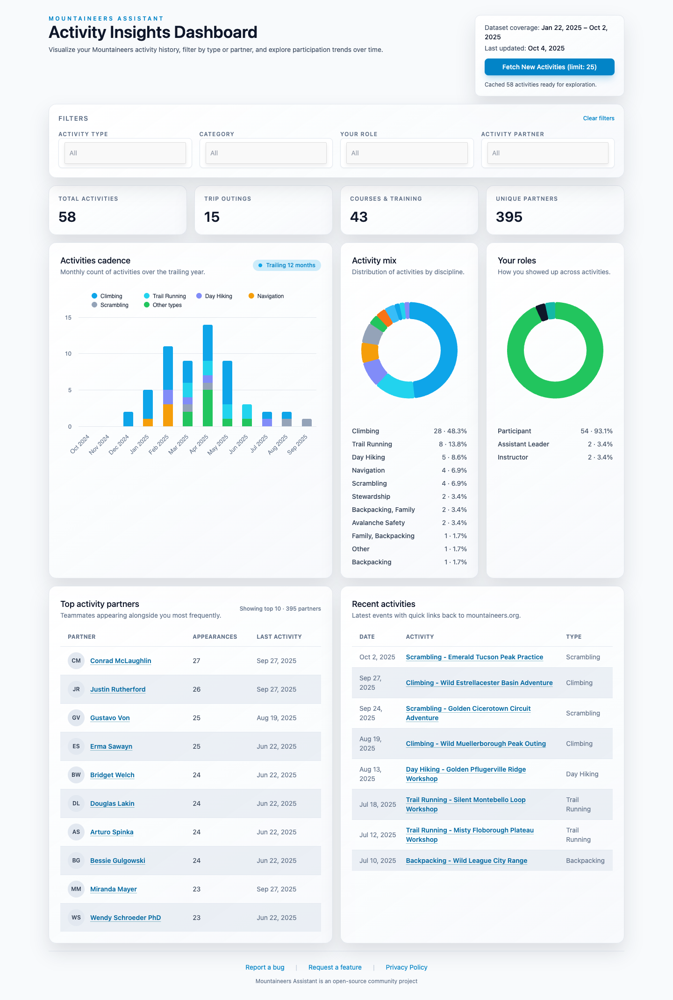
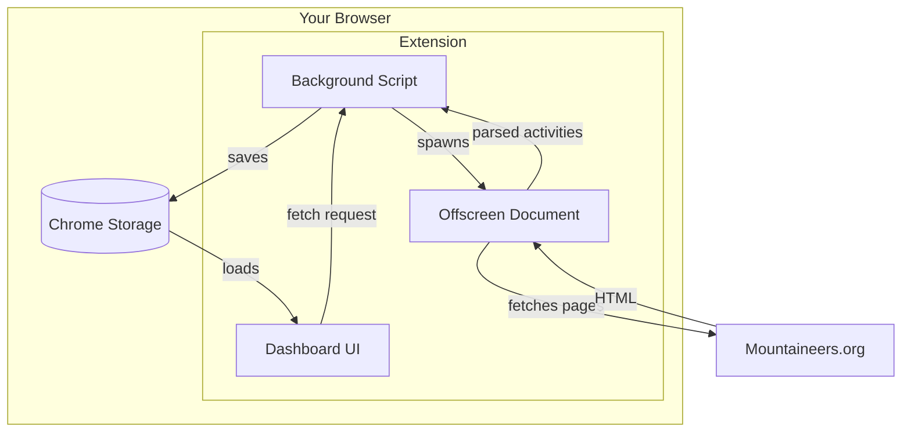

# Mountaineers Assistant

**Ever wonder who you've climbed with the most? Or how many activities you've done this year?**

Mountaineers.org doesn't make it easy to explore your own activity history. This extension fixes that.

## What it does

- Syncs your Mountaineers.org activity history (using your existing login)
- Shows you charts, stats, and trends you can't see on the site
- Helps you find patterns: who you climb with, what types of trips you do, your participation over time
- All your data stays on your device. No accounts, no tracking.

## Install

[**Get it from Chrome Web Store →**](https://chromewebstore.google.com/detail/mountaineers-assistant/dinamjoegfooacbhmhgbjeidfgcmbonl)

Or grab the latest build from [Releases](https://github.com/dreamiurg/mountaineers-assistant/releases).

## How it works

1. Log in to Mountaineers.org
2. Click the extension icon
3. Hit "Fetch New Activities"
4. Explore your data

The extension reads the same activity pages you see when logged in, parses the data, and stores everything locally in your browser.

### Under the hood

- **Background Script** — coordinates everything, handles extension lifecycle
- **Offscreen Document** — fetches and parses Mountaineers.org pages (runs in background so UI stays responsive)
- **Dashboard UI** — React app that visualizes your data with charts and filters
- **Chrome Storage** — local cache so you don't have to re-fetch every time

## Privacy

Your data **never leaves your browser**. No servers, no analytics, no third parties. [Full privacy policy →](PRIVACY.md)

---

## Other Mountaineering & Outdoors Tools

I climb, scramble, and hike a lot, and I keep building tools around it. If this one's useful to you, the others might be too:

- **[mountaineers-mcp](https://github.com/dreamiurg/mountaineers-mcp)** -- MCP server that lets AI assistants search and browse mountaineers.org. Activities, courses, trip reports, your account data. Works with Claude Desktop, Claude Code, and Codex CLI.
- **[peakbagger-cli](https://github.com/dreamiurg/peakbagger-cli)** -- Command-line access to PeakBagger.com. Search peaks, check elevation and prominence, browse ascent stats. Outputs JSON for piping into other tools.
- **[claude-mountaineering-skills](https://github.com/dreamiurg/claude-mountaineering-skills)** -- Claude Code plugin that generates route beta reports by pulling conditions, forecasts, and trip reports from multiple mountaineering sites.

---

Built in Seattle by a [fellow Mountaineer](https://www.mountaineers.org/members/dmytro-gayvoronskyy).

Questions? [Open an issue](https://github.com/dreamiurg/mountaineers-assistant/issues) · Want to help? [Contributing guide](CONTRIBUTING.md)
