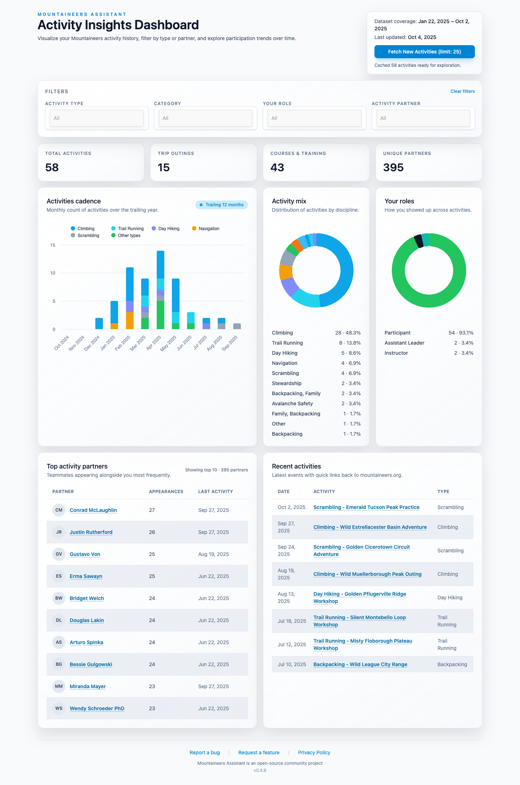
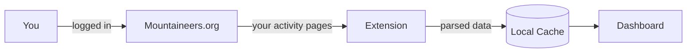
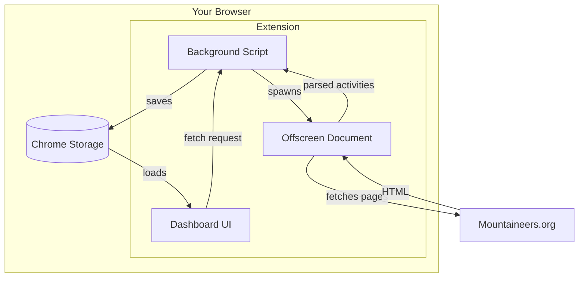

# Mountaineers Assistant

**Ever wonder who you've climbed with the most? Or how many activities you've done this year?**

Mountaineers.org doesn't make it easy to explore your own activity history. This extension fixes that.

> **Other projects you might like:** [PNW Climb Planner](https://dreamiurg.net/pnw-climb-planner.html) · [mountaineers-mcp](https://github.com/dreamiurg/mountaineers-mcp) · [peakbagger-cli](https://github.com/dreamiurg/peakbagger-cli) · [claude-mountaineering-skills](https://github.com/dreamiurg/claude-mountaineering-skills)

<a href='https://ko-fi.com/Q3N622FHZM' target='_blank'></a>



## What it does

- Syncs your Mountaineers.org activity history (using your existing login)
- Shows you charts, stats, and trends you can't see on the site
- Helps you find patterns: who you climb with, what types of trips you do, your participation over time
- All your data stays on your device. No accounts, no tracking.

## Install

[**Get it from Chrome Web Store →**](https://chromewebstore.google.com/detail/mountaineers-assistant/dinamjoegfooacbhmhgbjeidfgcmbonl)

Or grab the latest build from [Releases](https://github.com/dreamiurg/mountaineers-assistant/releases).

## How it works


```mermaid
flowchart LR
    A[You] -->|logged in| B[Mountaineers.org]
    B -->|your activity pages| C[Extension]
    C -->|parsed data| D[(Local Cache)]
    D --> E[Dashboard]
```

1. Log in to Mountaineers.org
2. Click the extension icon
3. Hit "Fetch New Activities"
4. Explore your data

The extension reads the same activity pages you see when logged in, parses the data, and stores everything locally in your browser.

### Under the hood


```mermaid
flowchart TB
    subgraph Browser["Your Browser"]
        subgraph Ext["Extension"]
            BG[Background Script]
            OFF[Offscreen Document]
            UI[Dashboard UI]
        end
        STORE[(Chrome Storage)]
    end

    WEB[Mountaineers.org]

    UI -->|"fetch request"| BG
    BG -->|"spawns"| OFF
    OFF -->|"fetches pages"| WEB
    WEB -->|"HTML"| OFF
    OFF -->|"parsed activities"| BG
    BG -->|"saves"| STORE
    STORE -->|"loads"| UI
```

- **Background Script** — coordinates everything, handles extension lifecycle
- **Offscreen Document** — fetches and parses Mountaineers.org pages (runs in background so UI stays responsive)
- **Dashboard UI** — React app that visualizes your data with charts and filters
- **Chrome Storage** — local cache so you don't have to re-fetch every time

## Development

```bash
bun install              # Install dependencies
bun run dev              # Start dev server
bun run check            # Typecheck + lint
bun run test:unit        # Unit tests
bun run test:coverage    # Unit tests with coverage enforcement
bun run complexity       # Cyclomatic complexity check
bun run ci               # Full local CI (check + test + complexity + build)
```

## Privacy

Your data **never leaves your browser**. No servers, no analytics, no third parties. [Full privacy policy →](PRIVACY.md)

Questions? [Open an issue](https://github.com/dreamiurg/mountaineers-assistant/issues) · Want to help? [Contributing guide](CONTRIBUTING.md)

---

## More from @dreamiurg

- 🏔️ **[PNW Climb Planner](https://dreamiurg.net/pnw-climb-planner.html)** — pick a Washington peak, see the odds of a climbable day from 20 years of weather data, and line up backups ([the story behind it](https://dreamiurg.net/2026/07/01/picking-backup-climbs.html))
- **[mountaineers-mcp](https://github.com/dreamiurg/mountaineers-mcp)** — mountaineers.org for AI assistants: activities, courses, routes, trip reports
- **[peakbagger-cli](https://github.com/dreamiurg/peakbagger-cli)** — search and analyze PeakBagger.com peak data in your terminal
- **[claude-mountaineering-skills](https://github.com/dreamiurg/claude-mountaineering-skills)** — automated route research: weather, hazards, and trip reports in one report
- more at [dreamiurg.net/projects](https://dreamiurg.net/projects/)

Made by [@dreamiurg](https://dreamiurg.net) in Seattle. If this project saved you time, you can [buy me a coffee](https://ko-fi.com/Q3N622FHZM) — appreciated, never expected.
